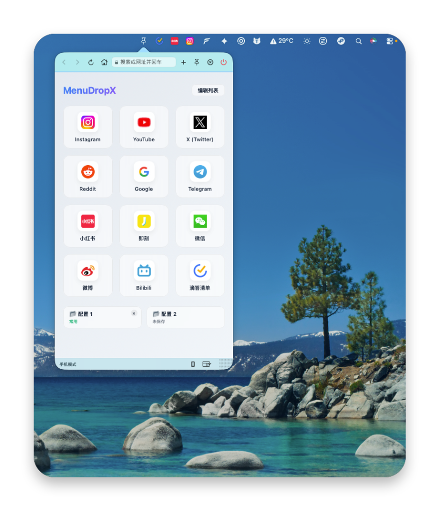
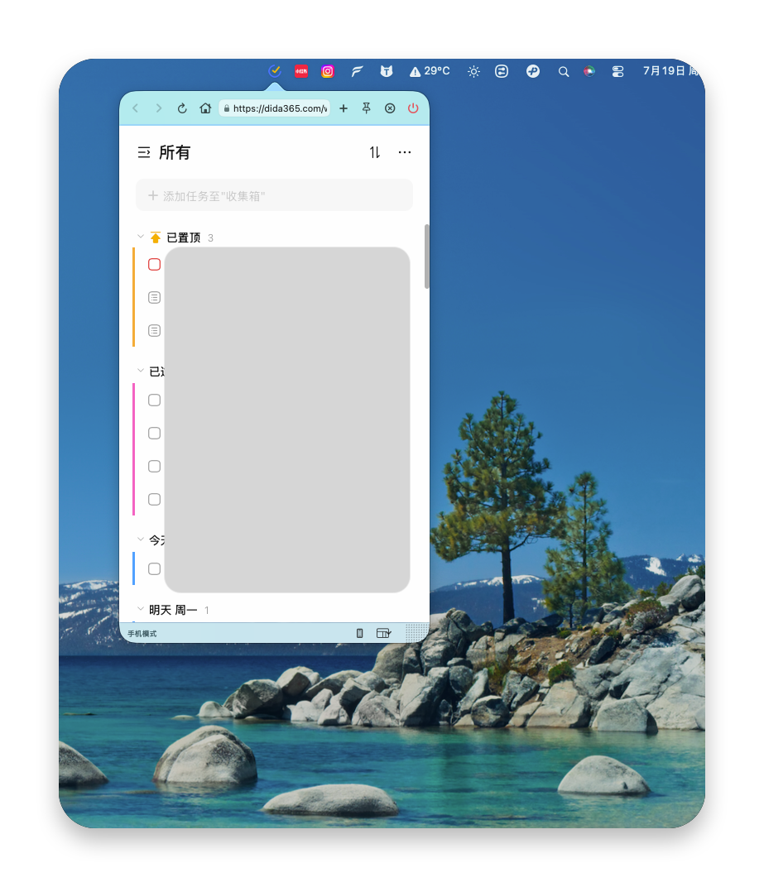
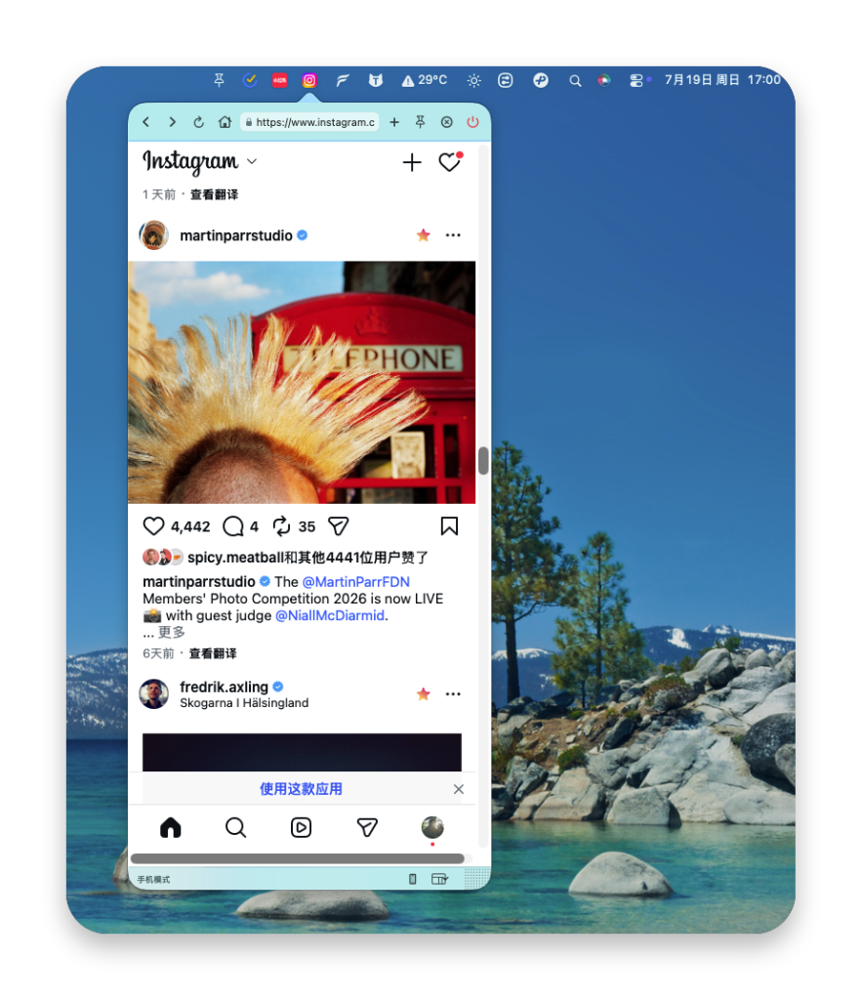

# MenuDropX

<p align="center">
  
</p>

<p align="center">
  <strong>一款极简、高能的 macOS 状态栏多开浏览器助手</strong>
</p>

<p align="center">
  <a href="./LICENSE"></a>
  <a href="https://developer.apple.com/macos/"></a>
  <a href="https://swift.org"></a>
</p>

---

**MenuDropX** 是一款专为 macOS 设计的轻量级状态栏浏览器管理工具。它打破了传统浏览器单一窗口的限制，允许用户在系统菜单栏上**多开**任意网页（如 AI 助手、监控仪表盘、即时文档等），并支持窗口尺寸自定义、多配置保存及智能的高保真彩色 Favicon 提取显示。

---

## 📸 界面预览

以下是 MenuDropX 的实际运行效果截图：

<p align="center">
   &nbsp;
  
</p>
<p align="center">
   &nbsp;
  
</p>

---

## ✨ 核心特性

- 🌐 **纯菜单栏形态 (MenuBar Only)**：启动时自动驻留状态栏，不占用 Dock 栏，不弹出多余的空白主窗口。
- ⚡ **多开浏览器实例**：支持同时创建多个独立的状态栏浏览器窗口，每个窗口可以加载不同的 URL。
- 📌 **窗口置顶 (Pin)**：一键锁定窗口，防止在点击屏幕其他区域时自动收起，非常适合边写代码边参考文档或监控状态。
- 📐 **自定义窗口尺寸**：支持自由调整或设置每个浏览器实例的宽度与高度，灵活适配不同网页的最佳显示比例。
- 🎨 **彩色 Favicon 高保真显示**：内置智能 Favicon 裁剪与处理算法。能够提取当前网页的高清 Favicon，并以原始彩色无损地渲染在状态栏图标上，让你一眼看清哪个图标对应哪个网站。
- 🖥️ **UA 智能切换**：一键在移动端 User-Agent 和桌面端 User-Agent 之间切换，自适应不同网页排版。
- 💾 **预设配置管理**：支持保存最多两套不同的多窗口预设配置（包括 URL 地址、窗口宽高、UA 设置）。在右键菜单中一键加载，还能为您的配置起个个性化的名字（例如：“我的工作台”、“摸鱼专用”）。
- 🔌 **优雅的系统集成**：支持通过窗口内的红色电源键唤起原生的 `NSMenu` 进行退出或快速保存配置，也支持右键点击状态栏图标直接执行管理。

---

## 🛠️ 技术架构

MenuDropX 采用了现代与经典混合的 macOS 开发模式：
- **SwiftUI**：用于构建精美、响应式的 UI 交互界面（如 `ContentView`）。
- **AppKit (Cocoa)**：底层桥接经典 `AppDelegate`，用于高控制度地管理 `NSStatusItem`、`NSPopover` 及其生命周期。
- **WebKit**：承载 `WKWebView` 保证优秀的网页渲染性能和安全性。
- **CoreImage & CGContext**：在 `BrowserInstance.processFaviconDual` 中用于分析 Favicon 像素边界，并裁剪出无白边的 16x16 高保真状态栏图标。

---

## 🚀 快速开始

### 运行环境要求
- **macOS**: 12.0 或更高版本
- **Xcode**: 13.0 或更高版本
- **Language**: Swift 5.5+

### 编译与安装步骤
1. **克隆项目到本地**：
   ```bash
   git clone https://github.com/yourusername/MenuDropX.git
   cd MenuDropX
   ```
2. **打开 Xcode 项目**：
   双击 `MenuDropX/MenuDropX.xcodeproj` 即可在 Xcode 中打开。
3. **运行/编译**：
   在 Xcode 中选择目标设备为 `My Mac`，然后按下 `Command + R` 编译并运行项目。
4. **归档与打包 (Optional)**：
   在 Xcode 菜单中选择 `Product` -> `Archive`，然后根据提示导出 `.app` 文件，即可直接拖入系统的 `Applications` 目录中日常使用。

---

## 💡 使用指南

1. **左键点击状态栏图标**：快速展开或收起对应网页的 Popover 窗口。
2. **右键点击状态栏图标**：
   - **新建浏览器窗口**：在状态栏增加一个新的浏览器图标。
   - **关闭当前窗口**：移除当前的浏览器实例（如果全部关闭，应用将自动安全退出）。
   - **保存配置**：支持将当前所有打开的窗口状态命名并保存至配置 1 或配置 2。
3. **电源键操作**：
   - 悬停于网页窗口左上角的红色电源键，点击可直接呼出快捷菜单进行预设配置保存或直接退出应用。

---

## 📄 开源协议

本项目基于 **[MIT License](LICENSE)** 协议开源，您可以自由地复制、修改和分发该项目。
