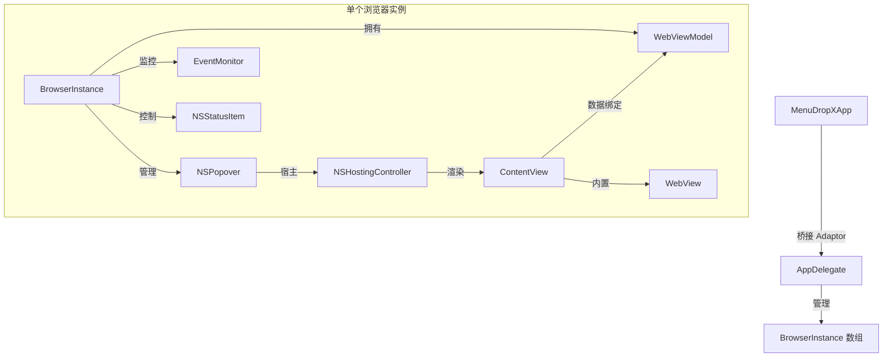

# MenuDropX 项目核心上下文 (Context)

记录 MenuDropX 项目的技术背景、核心架构设计、关键决策以及日常维护注意事项。

---

## 1. 项目基本信息

- **项目名称**：MenuDropX
- **应用类型**：macOS 纯菜单栏（MenuBar Only）浏览器多开工具
- **适用场景**：将常用的网页、H5 服务、AI 助手等以微型窗口形式常驻于 macOS 系统状态栏，点击即用，支持多开和快速配置切换。
- **技术语言**：Swift (SwiftUI + AppKit 混合架构)

---

## 2. 核心架构与设计

项目采用了经典的 **AppKit (Cocoa)** 负责系统级外设控制与生命周期管理，配合 **SwiftUI** 承载界面交互的设计模式。

### 2.1 多实例管理机制 (`BrowserInstance`)
- 应用不使用传统的 `WindowGroup` 作为主场景，而是在 `MenuDropXApp.swift` 里通过 `Settings { EmptyView() }` 避免默认空白窗口的弹出。
- `AppDelegate` 是全局的实例调度中心，维护着一个 `instances: [BrowserInstance]` 的数组。
- 每个 `BrowserInstance` 对应系统状态栏上的一个物理图标（`NSStatusItem`）和一个气泡悬浮窗（`NSPopover`）。
- 窗口的多开由 `AppDelegate.createNewInstance()` 实现，它会实例化一个新的 `WebViewModel` 并创建一个新的 `BrowserInstance` 加入队列。
- 当队列为空（所有状态栏窗口都被关闭）时，应用会自动调用 `NSApp.terminate(nil)` 退出进程。

### 2.2 数据流与通信机制 (`WebViewModel`)
- `WebViewModel` 是连接 SwiftUI 视图与 AppKit 控制层（`BrowserInstance` 和 `AppDelegate`）的桥梁。
- 视图层 `ContentView` 和 `WebView` 订阅 `WebViewModel` 的 `@Published` 属性，实现响应式 UI 刷新。
- 当视图层触发需要底层 Cocoa 介入的操作时，通过 ViewModel 预设的闭包进行回调。例如：
  - `onPinChanged`：通知 `BrowserInstance` 启动或停止 `EventMonitor`（防误触点击外部收起气泡）。
  - `onFaviconChanged`：通知 `BrowserInstance` 更新状态栏图标。
  - `onCreateNewInstance` 与 `onCloseInstance`：触发 `AppDelegate` 的多开和销毁。

### 2.3 核心算法：高保真 Favicon 双通道提取渲染
在 `BrowserInstance.processFaviconDual(image:)` 中实现了一套让状态栏完美适配网页 Favicon 的渲染逻辑：
1. **边界扫描**：直接读取 Favicon 图标像素数据，扫描其 Alpha 通道，识别非透明区域的紧凑边界。裁剪掉图片本身自带的多余空白边，避免图标在 16x16 尺寸下显得过小。
2. **彩色保留**：跳过 macOS 默认会将状态栏图标进行模板黑白化（`isTemplate = true`）的做法，直接将裁剪处理后的高保真彩色图标赋给 `NSStatusItem.button.image`，实现在状态栏完美还原网站品牌的彩色图标。

### 2.4 配置持久化与预设恢复
- **存储**：通过 `UserDefaults` 对 `AppPresetConfig` 进行 JSON 编码序列化存储。每个预设（配置 1 / 配置 2）均记录了当前所有打开窗口的 URL、窗口尺寸、UA 类型以及个性化名称。
- **恢复**：在加载预设配置时：
  - 第一个配置窗口在当前激活的浏览器实例中直接重装（通过 `WebViewModel.action` 加载）。
  - 其余配置窗口采用异步延迟加载，以防瞬间并发渲染导致 UI 闪烁。在实例初始化前先对 `urlInput` 赋值，从根本上规避 `updateNSView` 与气泡关闭之间的竞态条件。
  - 加载完成后，广播同步通知，促使所有活跃 WebView 更新其本地缓存的预设状态。

---

## 3. 开发与维护注意事项

- **网络权限 (App Sandbox)**：
  - 本应用启用了 App Sandbox。在发布或运行前，确保 Xcode 项目配置（`.entitlements` 文件）中已勾选 **Outgoing Connections (Client)**，否则 `WKWebView` 将无法加载任何外部网页。
- **内存与资源清理**：
  - 关闭浏览器实例时，必须调用 `BrowserInstance.destroy()`。该方法会显式调用 `popover?.close()`、`NSStatusBar.system.removeStatusItem` 以及注销 `EventMonitor`，防止发生内存泄漏和残留状态栏死图标。
- **交互规范**：
  - 窗口未被“钉住”(Pin) 时，`EventMonitor` 会监听全局的鼠标点击事件，点击窗口外部时自动收起 Popover。
  - 电源键不仅负责退出，还承载了保存配置的入口，改动相关原生 NSMenu 时需注意其在 `NSEvent.mouseLocation` 弹出的位置定位。
